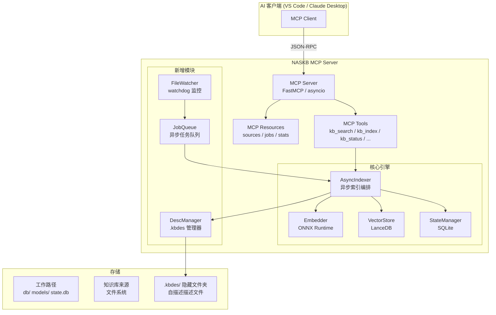

# NASKB MCP 知识库服务 — 设计规格

> **⚠️ 已取代（2026-08-11）**：本文基于 v1 架构（LanceDB + `.kbdes` sidecar + watchdog）。
> v2 架构（`.naskb/` 目录仓库 + PG 多 NAS 向量库 + 增量幂等 analyze）的接口设计见
> [agent-interface-design.md](./agent-interface-design.md)。本文仅作历史参考（JobQueue 思想已沿用）。

> 版本: v0.1  
> 状态: 草稿（历史）  
> 最后更新: 2026-06-05  
> 依赖: [requirement.md](./requirement.md), [implementation-plan.md](./implementation-plan.md)

---

## 1. 概述

### 1.1 定位

NASKB MCP 是 NASKB 项目的 MCP (Model Context Protocol) 服务器形态。它在一个**持续运行的本地服务**之上，提供完整的向量知识库管理能力。

与 Skill 形态 (`SKILL.md` + CLI) 的差异：

| 维度 | Skill 形态 | MCP 形态 |
|------|-----------|----------|
| 运行方式 | CLI 命令，用完即退 | 持续运行的常驻服务 |
| 通信方式 | 标准输入/输出 (文本) | MCP 协议 (JSON-RPC over stdio/HTTP) |
| 媒体描述存储 | 同名 `.md` 文件，与媒体文件并列 | 隐藏文件夹 `.kbdes/`，保持目录整洁 |
| 描述文件格式 | 普通 Markdown | 自描述元数据 + Markdown 内容 |
| 并行化 | 单进程串行 | 异步并行 I/O + 批量嵌入 |
| 文件监控 | 需手动触发 `naskb index --update` | 实时文件监控 + 自动增量索引 |
| 任务队列 | 无 | 内置任务队列 + 状态查询 |
| 接口 | CLI 参数 | MCP Tools + Resources |

### 1.2 核心增强

1. **持续服务**: 基于 MCP 协议，通过 stdio 或 HTTP 与 AI 客户端持续通信
2. **大规模并行**: 异步 I/O + 批量嵌入 + 线程池，充分利用多核 CPU / GPU
3. **完备 API**: MCP Tools + Resources + Prompts 完整覆盖知识库操作
4. **`.kbdes/` 隐藏文件夹**: 每个目录下的媒体描述集中存储在 `.kbdes/` 中，保持文件结构整洁
5. **自描述描述文件**: 每个描述文件自带生成时间、媒体版本摘要、文件哈希，支持过期检测
6. **实时文件监控**: 基于 `watchdog` 的文件夹监控 + 异步任务队列 + 状态查询

---

## 2. 架构设计

### 2.1 整体架构



### 2.2 模块职责

| 模块 | 文件 | 职责 |
|------|------|------|
| **MCP Server** | `naskb/mcp/server.py` | FastMCP 服务器主入口，注册 tools/resources |
| **MCP Tools** | `naskb/mcp/tools.py` | MCP 工具函数实现 |
| **Async Indexer** | `naskb/mcp/async_indexer.py` | 异步索引编排，批量并行处理 |
| **DescManager** | `naskb/mcp/desc_manager.py` | `.kbdes` 描述文件读写、过期检测 |
| **FileWatcher** | `naskb/mcp/watcher.py` | 文件系统监控 + 变更事件队列 |
| **JobQueue** | `naskb/mcp/job_queue.py` | 异步任务队列 + 状态查询 |

---

## 3. `.kbdes` 描述文件规范

### 3.1 目录结构

```
媒体文件夹/
├── photo.jpg              ← 媒体文件
├── video.mp4              ← 媒体文件
├── notes.md               ← 普通文本文件（不受影响）
└── .kbdes/                ← 隐藏描述文件夹
    ├── photo.jpg.kbdesc   ← photo.jpg 的自描述描述文件
    └── video.mp4.kbdesc   ← video.mp4 的自描述描述文件
```

### 3.2 自描述格式 (`.kbdesc`)

```yaml
# NASKB Description File v1
# ═══════════════════════════════════════
# 元数据区 (YAML frontmatter)
# ═══════════════════════════════════════
---
kbdesc_version: "1.0"
generated_at: "2026-06-05T10:30:00.000000+08:00"
generated_by: "naskb-mcp/0.2.0"
media_file: "photo.jpg"
media_info:
  size_bytes: 2048576
  mtime: 1717564800.0
  sha256: "a1b2c3d4e5f6..."
  mime_type: "image/jpeg"
  media_type: "image"
  width: 4032
  height: 3024
description_type: "auto_generated"   # auto_generated | manual | hybrid
description_hash: "md5_of_content"
# ═══════════════════════════════════════
# 内容区 (Markdown)
# ═══════════════════════════════════════
---

# photo.jpg

这是一张在桂林漓江拍摄的风景照片。

## 内容描述
- 场景: 桂林山水，漓江风光
- 天气: 晴天，有白云
- 主要元素: 喀斯特山峰、漓江水面、竹筏

## 标签
桂林, 漓江, 风景, 山水, 旅游
```

### 3.3 过期检测规则

DescManager 通过以下规则判断描述文件是否需要更新：

| 条件 | 判定 |
|------|------|
| `.kbdesc` 文件不存在 | ← 需生成 |
| `media_info.mtime` ≠ 当前文件 `mtime` | ← 需更新 |
| `media_info.size_bytes` ≠ 当前文件 `size_bytes` | ← 需更新 |
| `media_info.sha256` ≠ 当前文件哈希 | ← 需更新 |
| `kbdesc_version` < 当前版本 | ← 需迁移 |

---

## 4. MCP Tools 定义

### 4.1 工具一览

| Tool Name | 说明 | 参数 |
|-----------|------|------|
| `kb_search` | 语义检索知识库 | `query`, `top_k`, `threshold`, `source_id` |
| `kb_index_full` | 全量重建索引 | `source_ids`, `force` |
| `kb_index_incremental` | 增量更新索引 | `source_ids` |
| `kb_index_file` | 索引单个文件 | `source_id`, `file_path` |
| `kb_status` | 知识库状态报告 | `source_id` |
| `kb_list_sources` | 列出所有知识来源 | — |
| `kb_add_source` | 添加知识来源 | `name`, `url`, `fs_type` |
| `kb_remove_source` | 移除知识来源 | `source_id` |
| `kb_list_missing` | 列出缺失描述的文件 | `source_id` |
| `kb_describe_media` | 手动为媒体文件添加/更新描述 | `source_id`, `media_path`, `description` |
| `kb_get_job_status` | 查询后台任务状态 | `job_id` |
| `kb_list_jobs` | 列出所有后台任务 | `status_filter` |
| `kb_start_watcher` | 启动文件监控 | `source_ids` |
| `kb_stop_watcher` | 停止文件监控 | `source_ids` |

### 4.2 详细签名

```python
# 检索
kb_search(query: str, top_k: int = 10, threshold: float = 0.5, source_id: str | None = None) -> str

# 索引
kb_index_full(source_ids: list[str] | None = None, force: bool = False) -> str
kb_index_incremental(source_ids: list[str] | None = None) -> str
kb_index_file(source_id: str, file_path: str) -> str

# 状态
kb_status(source_id: str | None = None) -> str
kb_list_sources() -> str
kb_list_missing(source_id: str | None = None) -> str

# 来源管理
kb_add_source(name: str, url: str, fs_type: str = "local") -> str
kb_remove_source(source_id: str) -> str

# 媒体描述
kb_describe_media(source_id: str, media_path: str, description: str, tags: str = "") -> str

# 任务管理
kb_get_job_status(job_id: str) -> str
kb_list_jobs(status_filter: str = "all") -> str

# 文件监控
kb_start_watcher(source_ids: list[str] | None = None) -> str
kb_stop_watcher(source_ids: list[str] | None = None) -> str
```

---

## 5. 文件监控与任务队列

### 5.1 监控机制

- 基于 `watchdog` 库的 `Observer` 模式
- 每个被监控的来源目录启动一个独立的 `Observer`
- 检测事件: `created`, `modified`, `deleted`, `moved`
- 事件去重: 500ms 窗口内同一路径的多个事件合并为一次
- 排除 `.kbdes/`、`.git/` 等隐藏/排除目录内的事件

### 5.2 任务队列

```
JobQueue (asyncio.Queue)
├── Job: index_file(source_id, path)     ← 文件变更触发
├── Job: generate_desc(source_id, path)  ← 新媒体文件触发
├── Job: update_desc(source_id, path)    ← 媒体文件更新触发
├── Job: remove_index(source_id, path)   ← 文件删除触发
└── Job: full_index(source_id)           ← 手动触发
```

每个 Job 记录:
- `job_id`: UUID
- `type`: 任务类型
- `status`: pending / running / completed / failed
- `created_at` / `started_at` / `completed_at`
- `result` / `error`
- `progress`: 0.0 ~ 1.0

### 5.3 并行策略

- **异步 I/O**: aiofiles + fsspec async 后端并发读取文件
- **批量嵌入**: 收集够 batch_size 后统一提交给 Embedder（Native 线程执行）
- **Worker 池**: configurable 的并发 worker 数 (默认 CPU 核心数)
- **GPU 独占**: Embedder 调用通过 `asyncio.to_thread` 在单独线程中执行

---

## 6. 文件结构

```
naskb/
├── mcp/
│   ├── __init__.py              # MCP 包入口
│   ├── server.py                # FastMCP 服务器主程序
│   ├── tools.py                 # MCP Tool 函数实现
│   ├── async_indexer.py         # 异步索引编排器
│   ├── desc_manager.py          # .kbdes 描述文件管理器
│   ├── watcher.py               # 文件系统监控
│   └── job_queue.py             # 异步任务队列
├── ... (现有模块保持不变)
```

---

## 7. MCP 配置 (mcp.json)

```json
{
  "mcpServers": {
    "naskb": {
      "command": "python",
      "args": ["-m", "naskb.mcp.server"],
      "env": {
        "NASKB_WORK": "D:/NASKB_data"
      }
    }
  }
}
```

---

## 8. 向后兼容

- MCP 服务器与 Skill 形态**共享同一份工作路径**
- 同一个 `db/` (LanceDB) 存储两级索引
- 同一个 `state.db` (SQLite) 跟踪索引状态
- MCP 的 `.kbdesc` 文件与 Skill 的 `.md` 描述文件可以**共存**
- CLI 工具后续可增加 `--kbdesc` 模式支持 `.kbdesc` 格式

---

> **下一步**: 按模块逐步实现代码。
