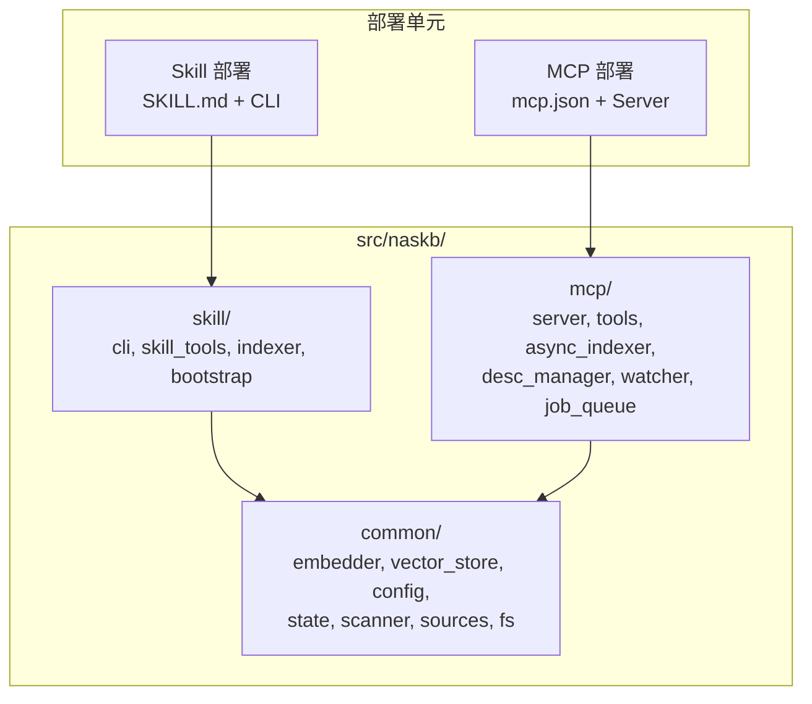

# NASKB 高并发 MCP 架构 — 技术选型重评估

> **⚠️ 已取代（2026-08-11）**：本文基于 v1 架构选型（LanceDB/ONNX session pool 等）。
> v2 接口设计见 [agent-interface-design.md](./agent-interface-design.md)（能力注册表 + MCP/REST/function schema 多出口）。
> 本文仅作历史参考（common 层与部署形态解耦原则已沿用）。

> 版本: v0.3  
> 日期: 2026-06-05（历史）  
> 依赖: [requirement.md](./requirement.md), [mcp-kb-design.md](./mcp-kb-design.md)

---

## 1. 问题背景

Skill 形态是单用户、串行、用完即退的 CLI 工具。MCP 形态是持续服务、多客户端并发、高吞吐的常驻进程。两者的资源使用模式根本不同：

| 维度 | Skill (CLI) | MCP (Service) |
|------|-------------|---------------|
| 并发模型 | 单进程串行 | 多协程/多线程并发 |
| 生命周期 | 用完即退 | 7×24 持续运行 |
| 请求模式 | 命令行一次性 | 持续 RPC 调用 |
| 内存策略 | 用后释放 | 常驻复用 |
| 瓶颈 | 冷启动时间 | 并发吞吐 QPS |

因此需要在三个核心技术选型上重新评估。

---

## 2. (a) 嵌入模型选型

### 当前选型
- **BGE-base-zh-v1.5** (768维) 或 **BGE-large-zh-v1.5** (1024维)
- 转为 ONNX 格式，本地推理

### MCP 场景分析

| 考量 | 评估 |
|------|------|
| 模型大小 | base: ~102MB, large: ~326MB。MCP 常驻内存后，large 可接受 |
| 推理延迟 | base: ~5ms(GPU)/~30ms(CPU), large: ~8ms/~60ms |
| 并发吞吐 | ONNX 推理是 CPU-bound，batch_size 越大吞吐越高 |
| 中文质量 | large 明显优于 base，适合作为服务的默认选择 |

### 结论：**保持 BGE 系列，不做更换**

- MCP 服务默认使用 `bge-large-zh-v1.5`（精度优先，常驻内存可接受大小）
- Skill 保持 `bge-base-zh-v1.5` 作为默认（冷启动更快）
- 通过 `config.toml` 中的 `model.name` 配置切换
- **增加抽象层**：`common/embedder.py` 定义 `BaseEmbedder` 接口，支持未来接入远程嵌入服务（如 TEI、OpenAI-compatible API）

---

## 3. (b) 模型运行框架选型

### 当前选型
- **ONNX Runtime** + DirectML (GPU) / CPU

### MCP 场景分析

| 考量 | 评估 |
|------|------|
| 线程安全 | ONNX Runtime session **非线程安全**，需一个 session 对应一个线程 |
| 并发策略 | 需要 **session pool**：每个 worker 线程持有独立 session |
| GPU 资源 | DirectML 单 session 独占 GPU，多 session 需排队 |
| 替代方案 | ONNX Runtime 支持 `inter_op_num_threads` / `intra_op_num_threads` 调优 |

### 结论：**保持 ONNX Runtime，但增加 session pool**

- `common/embedder.py` 中的 `Embedder` 本身不变（单个 session）
- MCP 层通过 `asyncio.to_thread` + `ThreadPoolExecutor` 串行化 GPU 推理
- `async_indexer.py` 中批量收集文本后一次性提交给 embedder
- 未来可扩展：在 `common/embedder.py` 中增加 `EmbedderPool` 类，管理多个 session 实例

```
Skill 用法:
  embedder = Embedder(model_path, tokenizer_path, "DirectML")
  vec = embedder.encode("你好世界")

MCP 用法:
  embedder = Embedder(model_path, tokenizer_path, "DirectML")
  vecs = await asyncio.to_thread(embedder.encode_batch, texts)
```

**选择 ONNX Runtime 而非其他框架的理由**：
- 与现有 Skill 形态共享同一份模型文件
- DirectML 兼容老旧 GPU（用户的核心约束）
- 零额外服务依赖

---

## 4. (c) 向量数据库选型

### 当前选型
- **LanceDB** (嵌入式，基于 Lance 列存格式)

### MCP 场景分析

| 考量 | 评估 |
|------|------|
| 并发读 | LanceDB 基于 Arrow，**读操作天然支持高并发** |
| 并发写 | LanceDB 写操作需要版本协调，**高并发写有冲突风险** |
| 替代方案 | Qdrant (嵌入式) — 更好的并发写支持；Milvus Lite — 全功能嵌入式 |

### 实际评估

| 数据库 | 嵌入模式 | 并发读 | 并发写 | 过滤 | 适用 |
|--------|----------|--------|--------|------|------|
| **LanceDB** | ✅ | ★★★★ | ★★☆ | ✅ | 读多写少 |
| Qdrant (embedded) | ✅ | ★★★★★ | ★★★★ | ✅ | 读写均衡 |
| Milvus Lite | ✅ | ★★★★★ | ★★★★ | ✅ | 大规模 |
| FAISS + SQLite | ⚠️ | ★★★★★ | ★★★ | 手动 | 极简 |

### 结论：**保持 LanceDB，通过 JobQueue 串行化写操作**

- MCP 的 `JobQueue` 已经确保同一时刻只有一个索引写操作在执行
- 搜索（读操作）可以高并发，不受影响
- LanceDB 的列存格式对向量检索性能优秀
- **增加抽象层**：`common/vector_store.py` 定义 `BaseVectorStore` 接口

```python
class BaseVectorStore(ABC):
    """向量数据库抽象接口。"""
    @abstractmethod
    def search(self, vector, top_k, threshold, source_id) -> list[SearchResult]: ...
    @abstractmethod
    def add_files(self, records: list[dict]) -> None: ...
    @abstractmethod
    def delete_by_source(self, source_id: str) -> None: ...
    @abstractmethod
    def count(self, table: str = "files") -> int: ...
```

当前提供 `LanceDBStore` 实现。未来可增加 `QdrantStore`。

---

## 5. 代码结构重构方案

### 5.1 目标结构

```
naskb/                          # 项目根
├── design/                     # 设计文档
├── src/
│   └── naskb/                  # Python 包根
│       ├── __init__.py
│       ├── common/             # 共享抽象 + 基础实现
│       │   ├── __init__.py
│       │   ├── config.py       # Config (不变)
│       │   ├── embedder.py     # BaseEmbedder + Embedder(ONNX)
│       │   ├── vector_store.py # BaseVectorStore + LanceDBStore
│       │   ├── state.py        # StateManager (SQLite)
│       │   ├── scanner.py      # Scanner (文件扫描)
│       │   ├── sources.py      # KnowledgeSource + SourceManager
│       │   ├── model_manager.py
│       │   └── fs/             # FileSystemAdapter
│       ├── skill/              # Skill 形态
│       │   ├── __init__.py
│       │   ├── cli.py          # Click CLI 入口
│       │   ├── skill_tools.py  # Copilot Skill 工具
│       │   ├── indexer.py      # 同步索引编排
│       │   └── bootstrap.py    # 环境引导
│       └── mcp/                # MCP 形态
│           ├── __init__.py
│           ├── server.py       # FastMCP 服务器
│           ├── tools.py        # 16 个 MCP Tool
│           ├── async_indexer.py
│           ├── desc_manager.py
│           ├── watcher.py
│           └── job_queue.py
├── SKILL.md                    # Skill 声明文件
├── mcp.json                    # MCP 配置模板
└── pyproject.toml
```

### 5.2 依赖关系



### 5.3 关键设计原则

1. **common 层不可依赖 skill 或 mcp**：共享代码独立于部署形态
2. **skill 和 mcp 之间不互相依赖**：各自独立，仅共享 common
3. **部署时可按需选择**：Skill 部署不需要 mcp 代码，反之亦然
4. **向后兼容**：config.toml、db/、models/ 等运行时数据格式不变

---

## 6. 迁移影响评估

| 影响范围 | 变更 |
|----------|------|
| 内部 import | `from .config` → `from ..common.config` |
| CLI 入口 | `naskb.cli:main` → `naskb.skill.cli:main` |
| MCP 入口 | `naskb.mcp.server:main` → `naskb.mcp.server:main` (不变) |
| 工作路径数据 | **零影响** — config.toml, db/, models/, state.db 格式不变 |
| SKILL.md | 更新工具模块引用路径 |
| mcp.json | 更新 server 命令路径 |
| pyproject.toml | 更新 `[tool.setuptools.packages.find]` 和入口点 |
| 测试 | 更新 import 路径 |
